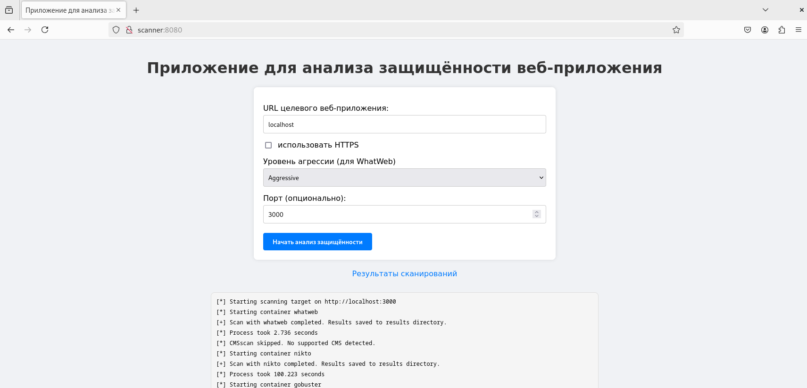
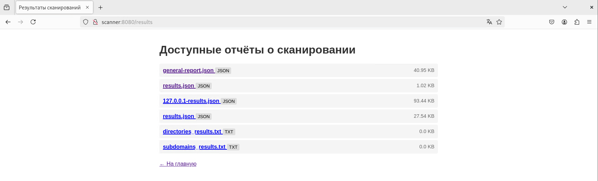
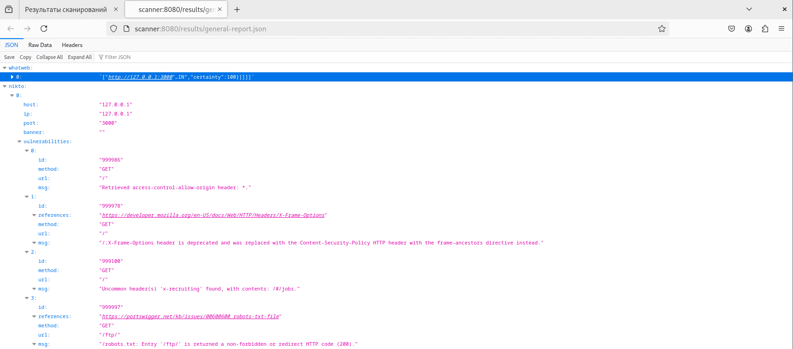

# **Приложения для автоматизации анализа защищённости веб-приложений**

Реализовано студентом Национального исследовательского ядерного университета "МИФИ" группы Б21-515 Черняковым Алексеем в рамках выпускной квалификационной работы бакалавра.

## **Примеры работы приложения**

Рисунок 1 - Сканирование тестового приложения (OWASP Juice Shop)

Рисунок 2 - Просмотр доступных отчётов (отдельных инструментов и разработанного приложения)

Рисунок 3 - Пример содержимого отчёта
